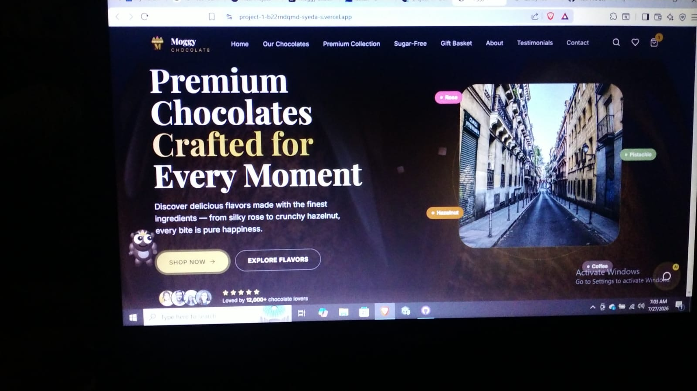
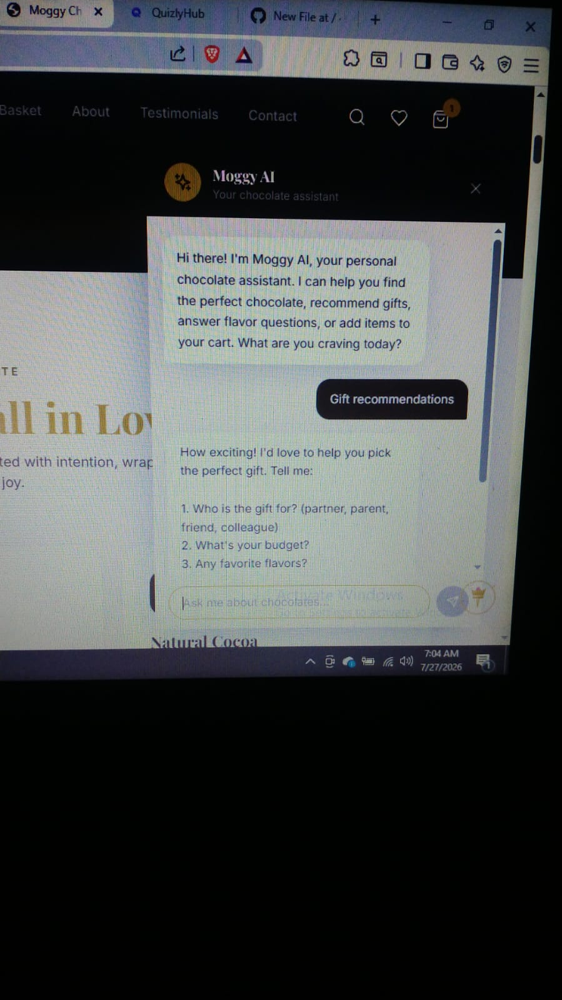
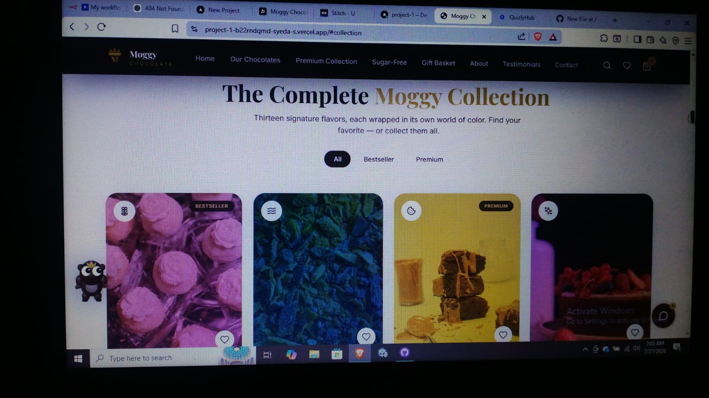

# Moggy Chocolates 🍫

### a. App Name + Problem
Moggy Chocolates is an e-commerce website for premium handcrafted chocolates. 
Problem: Finding and gifting premium chocolates online is hard. This app makes it easy with AI recommendations.

### b. LIVE URL
https://project-1-omega-rust.vercel.app/

### c. Key Features
- Beautiful product showcase with 13 signature flavors
- Add to Cart + Wishlist functionality
- Responsive design for mobile + desktop
- **Moggy AI Chatbot** for personalized gift recommendations

### d. AI Feature
**Moggy AI - Your Chocolate Assistant**
d. AI Feature

Moggy AI - Your Chocolate Assistant 
What it does: Recommends chocolates and gifts based on occasion, budget, and flavor preference. 
How: Currently using mock AI responses for demo. Built with ChatGPT prompts. 
System Prompt: "You are Moggy AI, a friendly chocolate expert. Help users find the perfect chocolate gift by asking about occasion, budget, and favorite flavors. Keep tone warm and premium."

### e. Tools & Technologies
Frontend: React, Vite, Tailwind CSS
Hosting: Vercel
AI: Google Gemini API
Version Control: Git + GitHub

### f. Screenshots

## 📸 Screenshots

### 2. Code 

### 3. Website with Ghost

### 1. AI Prompt

https://github.com/syedakamal308-githup/project-1/blob/main/website_page-0018.jpg

### g. How to Run Locally
1. Clone the repo: `git clone https://github.com/syedakamal308-github/project-1`
2. Install dependencies: `npm install`
3. Run the app: `npm run dev`
4. Open http://localhost:5173
